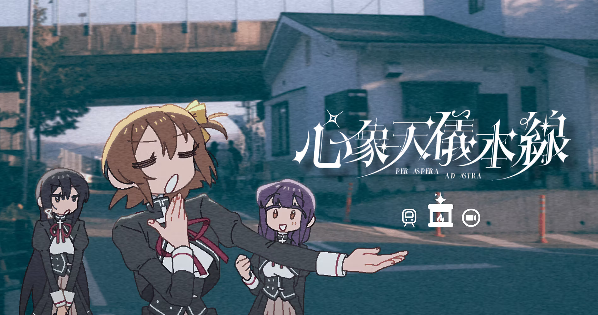

Title: 心象天儀本線 \~per aspera ad astra\~ 
Developer: Atelier Ueshima Erika 
VNDB: https://vndb.org/v54933 
Official Website: https://www.hoshiorigakuen.com/ 
Steam: https://store.steampowered.com/app/3664060/

Demo release for the doujin visual novel *心象天儀本線 \~Per Aspera Ad Astra\~*, demo dropped January 29, 2026, ahead of the full release later in 2026. It caught my attention when I looking up new game on Steam, because of it uniq *doujin* art style, 4:3 resolution and the incredibly ancient UI give it a classic visual novel feel, it reminds me of early 2000–2010 visual novels.



It's a debut doujin visual novel from Atelier Ueshima Erika — a small indie studio out of Taiwan, as far as I can tell — and you play as 上島椿 (Ueshima Tsubaki) at the end of the demo, a mysterious girl reveals that it's actually Ueshima Tsubaki who has been talking to you — the player — all along in train, a transfer student arriving at the 星織學園 (Hoshiori Academy). The story is told through what the game calls "touching tickets": fragmented vignettes that slowly build toward something larger. A Literature Club. A galactic train. Recurring dreams. It shouldn't cohere, and yet it does.

What gets me is how intentional it all feels. The dreamlike art and surreal structure don't come across as aesthetic choices slapped on top — they feel load-bearing, like the whole thing would collapse without them. And the soundtrack by composer 10lulu (60+ tracks planned for the full release, apparently), which I really like, its doing a lot of heavy lifting in the best possible way.

The full release is planned for later in 2026, promising 7–9 hours of playtime. If the demo is fit your type, this is one to keep on your wishlist. :L 
I will make another post once it released and I when through. :L
