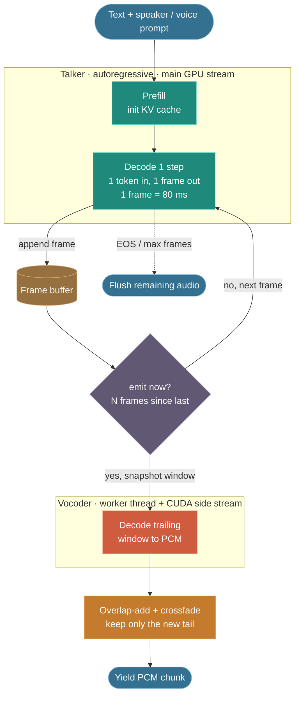
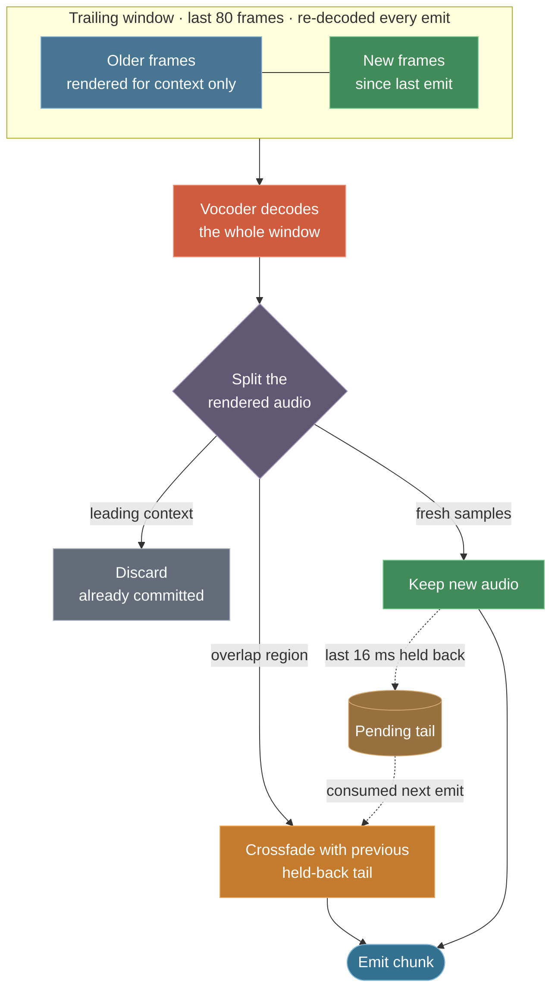
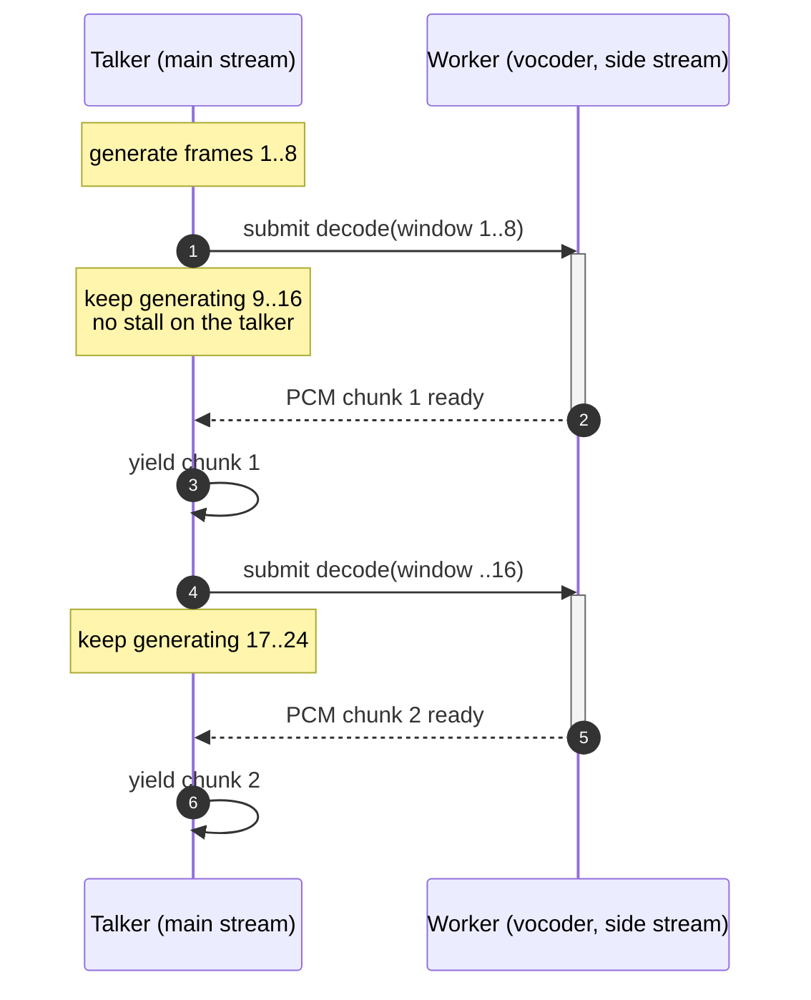
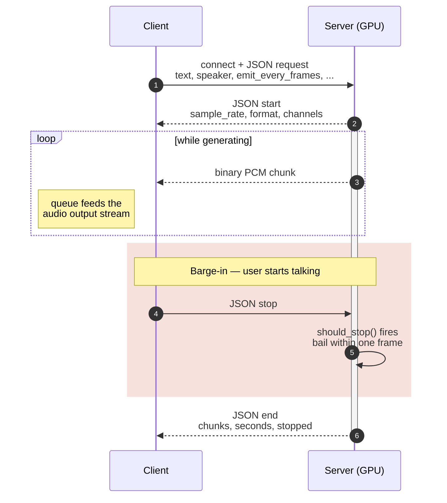

Most text-to-speech runs in batch mode: you submit a sentence, wait a second or two, and get back a complete `.wav`. That is fine for offline narration, but poor for interactive use, where the user waits for the entire reply to synthesize before hearing anything.

Streaming TTS begins playback while the rest of the utterance is still being generated. It has two requirements: a low **time-to-first-audio (TTFA)**, and a chunk rate that stays ahead of real-time playback so the output never underruns.

This post covers the streaming layer I built on top of a [Qwen3-TTS](https://github.com/QwenLM) model: the codec-frame loop, sliding-window vocoder decoding, the crossfade that removes chunk-boundary artifacts, and a WebSocket transport with client-side interruption.

---

## Model architecture

The model has two stages:

1. **Talker**: an autoregressive transformer. Given the text and a conditioning prompt (speaker, instruction, or reference voice), it generates *codec frames* one at a time, the same way an LLM generates tokens. Each frame is a small group of discrete codes.
2. **Speech tokenizer (vocoder)**: a neural codec decoder that converts a sequence of codec frames into a PCM waveform.

I use the 12 Hz tokenizer. The relevant figures:

| Quantity | Value |
| --- | --- |
| Output sample rate | `24000 Hz` |
| Samples per codec frame (`decode_upsample_rate`) | `1920` |
| Effective frame rate | `24000 / 1920 = 12.5` frames/s |
| **Duration of one frame** | **`80 ms`** |

One codec frame is therefore 80 ms of audio. That figure sets every latency trade-off below.

> The 25 Hz tokenizer cannot stream this way: it needs x-vectors and reference mels at decode time, which are not available on a per-frame basis. Streaming is limited to the 12 Hz tokenizer.

---

## Why splitting a batch result doesn't work

The obvious approach is to generate the full utterance, split the waveform into chunks, and send them in order. This does nothing for TTFA: the first chunk still cannot leave until generation finishes.

A real solution has to address both stages:

- The talker must be driven frame by frame, so frames become available incrementally.
- The vocoder must decode a *partial* sequence into usable audio for the completed portion, without audible seams between successive partial decodes.

The second requirement is the hard one. The vocoder is convolutional, with a receptive field that spans many frames. Decoding frames `[0..8)` and `[8..16)` independently and concatenating the results produces a click at every boundary, because neither decode has the context the other relied on.

---

## The core loop

The full pipeline:



The streaming entry point is a Python generator that yields `(pcm_chunk, sample_rate)` tuples. The stages:

### 1. Prefill, then one frame at a time

The text prompt is encoded once, in a prefill pass that initializes the KV cache. Each subsequent step feeds the previously sampled token back in and runs a single-token forward pass against the cached state. This is the standard autoregressive decoding loop. Every step produces one codec frame (about 80 ms of speech) and appends it to a buffer.

```text
prefill(prompt) -> kv_cache, first_token
loop:
    frame, next_token = talker.step(token, kv_cache)
    if frame == EOS: break
    buffer.append(frame)
    ...emit logic...
```

### 2. Emit cadence and time-to-first-audio

Two parameters control when audio is emitted:

- `emit_every_frames` (default 8) sets the steady-state cadence. One chunk is produced every 8 frames, or `8 × 80 ms = 640 ms` of audio per emit.
- `first_emit_frames` (default 4) sets a shorter delay for the first chunk only. Emitting after 4 frames instead of 8 reduces TTFA by `(8 − 4) / 12.5 ≈ 320 ms`, at the cost of slightly less decoder context for that first chunk.

Emitting the first chunk early and then settling into the steady cadence keeps startup latency low without making every later chunk unnecessarily small.


### 3. Sliding-window decoding

This is what keeps the audio clean. Instead of decoding only the 8 new frames, each emit decodes a *trailing window* of the last `decode_window_frames` (default 80) frames, and keeps only the newly produced tail samples:



Re-decoding the trailing context on every emit gives the vocoder enough receptive field to render the new samples correctly, so the result stays close to a full offline decode.

The window is capped by `max_decode_window_frames` (default 96). Beyond the vocoder's receptive field (roughly 96 frames, about 7.7 s), a larger window adds no quality but increases per-emit decode cost, which on a long utterance can exceed the real-time budget and cause stutter. Short clips never reach the cap and keep full quality. The effective window is `min(decode_window_frames, max_decode_window_frames)`.

### 4. Overlap-add crossfade

Even with a sliding window, two consecutive renders of the same region are not bit-identical, so a hard concatenation still produces a click. The standard fix is overlap-add: each chunk withholds its last `overlap_samples` (default 384, about 16 ms). The next window re-renders that region, and the two renders are linearly crossfaded:

```python
def crossfade(prev_tail, new_head):
    n = min(len(prev_tail), len(new_head))
    w = np.linspace(0.0, 1.0, n, dtype=np.float32)
    return prev_tail[:n] * (1.0 - w) + new_head[:n] * w
```

Because both sides render the same audio, the crossfade is seamless, with no click and no phasing. The withheld tail is committed on the next emit, and a final flush drains it at the end of the stream.

### 5. Decode pipelining

The talker (autoregressive, latency-bound) and the vocoder (a heavier convolutional decode) compete for the GPU. Running the vocoder inline stalls the frame loop on every emit, which shows up as periodic hitches in the output.

The window decode therefore runs on a worker thread with its own CUDA side stream, overlapping vocoder kernels with the talker's next frames:



At most one decode is in flight at a time, so chunks are always returned in order. The output is bit-identical to the inline path; pipelining only improves throughput.

### 6. Quality and control details

- **Reference-code priming (voice clone / ICL).** At the start of a stream the window holds only a few frames, which is too little context and causes vocoder artifacts. When a reference voice is available, the tail of the reference codes is prepended as decoder context for the first few windows, then stripped from the output.
- **Cooperative cancellation.** A `should_stop()` callback is polled once per frame. When it returns true, generation stops before the next forward pass, flushes any buffered audio, and returns. This is the mechanism a client uses to interrupt mid-sentence.

---

## WebSocket transport

The transport is a small FastAPI WebSocket server with a deliberately minimal protocol:

1. The client connects and sends a single JSON request (`text`, `language`, `speaker`/`instruct`/`ref_audio`, and the streaming parameters).
2. The server replies with a JSON `start` message (`sample_rate`, `format`, `channels`).
3. The server streams binary PCM frames (`pcm_s16le` or `pcm_f32le`) as they are produced.
4. The server closes with a JSON `end` message (chunk count, duration, and whether the stream was stopped).



Generation runs in a thread-pool executor and feeds an `asyncio.Queue`, leaving the event loop free to push bytes to the socket and watch for a `stop` message or a disconnect at the same time. The watcher sets the `should_stop` event. This is the barge-in path: when the user starts speaking, the client sends `stop` and the GPU stops within a frame rather than finishing the sentence.

On the client, playback is a queue feeding a `sounddevice` output stream on its own thread, so network jitter does not underrun the output device:

```python
async for m in ws:
    if isinstance(m, str):          # JSON control frame
        meta = json.loads(m)
        if meta["type"] == "start":
            sr = meta["sample_rate"]
            player = Player(sr)     # opens an OutputStream
        else:                       # "end" / "error"
            break
    else:                           # binary PCM
        player.feed(decode(m, fmt)) # non-blocking, queued
```

TTFA is the arrival of the first binary frame. With `first_emit_frames=4` it lands within a few hundred milliseconds of the request.

---

## Tuning reference

| Parameter | Default | Lower it → | Raise it → |
| --- | --- | --- | --- |
| `first_emit_frames` | 4 | faster first audio, thinner first-chunk context | safer start, slower TTFA |
| `emit_every_frames` | 8 | smaller/more frequent chunks, more decode overhead | fewer, chunkier emits |
| `decode_window_frames` | 80 | cheaper decodes, less context → more artifacts | better quality, costlier per emit |
| `max_decode_window_frames` | 96 | caps decode cost on long clips | (past ~96 = wasted compute) |
| `overlap_samples` | 384 | shorter crossfade, risk of seams | smoother seams, slightly more rework |

On a single modern GPU the defaults keep generation comfortably ahead of real time while staying close to offline-decode quality.

---

## Summary

Most of the work in streaming TTS is in the system around the model, not the model itself:

- Drive the talker frame by frame with a KV cache.
- Decode a sliding window rather than isolated chunks, so the vocoder always has context.
- Use overlap-add crossfade to join independent decodes without artifacts.
- Pipeline the vocoder off the talker's critical path.
- Provide a transport with a working stop / barge-in path.

With each frame at 80 ms, every one of these choices trades latency against audio quality. The defaults above are the balance that has held up best for interactive use.
