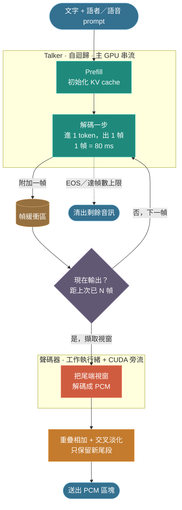
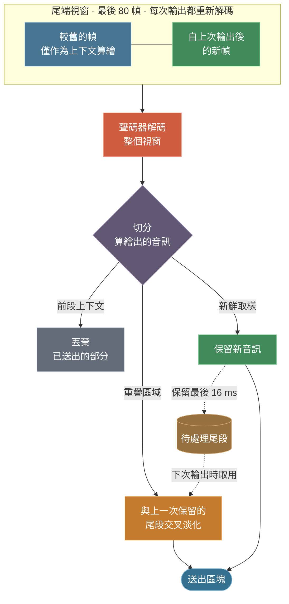
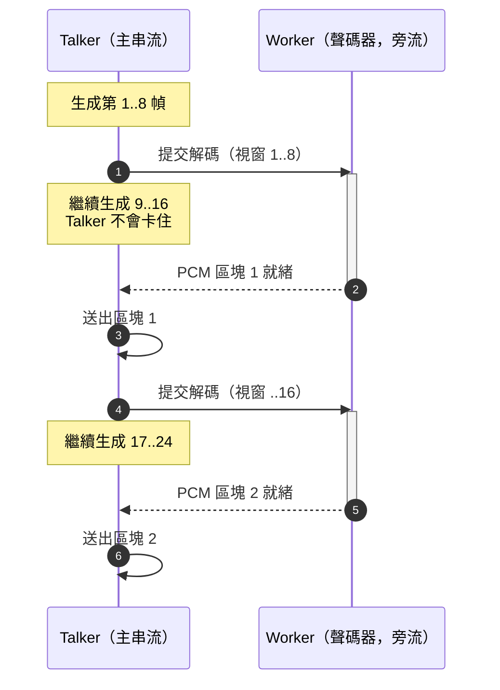
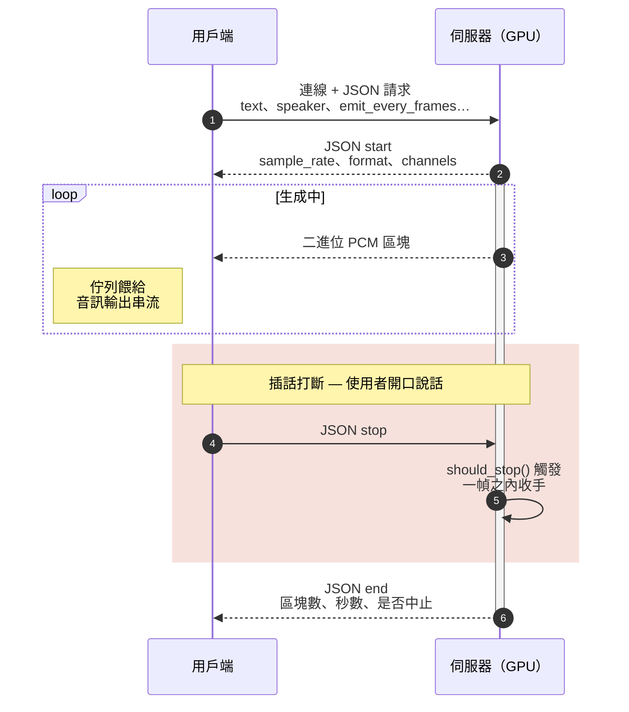

多數文字轉語音（TTS）以批次方式運作：送進一句文字，等待一兩秒，取回一整段 `.wav`。這用於離線旁白並無問題，但對互動場景並不理想，因為使用者必須等整段回覆合成完畢，才聽得到第一個聲音。

串流 TTS 則在其餘內容仍在生成時就開始播放。它有兩項要求：壓低**首音延遲（time-to-first-audio, TTFA）**，並讓區塊的產出速度持續快於即時播放，使輸出不致斷流。

本文說明我在 [Qwen3-TTS](https://github.com/QwenLM) 模型上實作的串流層：codec 幀迴圈、滑動視窗聲碼器解碼、消除區塊接縫的交叉淡化，以及支援用戶端中斷的 WebSocket 傳輸。

---

## 模型架構

此模型分為兩個階段：

1. **Talker（說話端）**：一個自迴歸 Transformer。給定文字與條件 prompt（語者、指令或參考語音），它會逐一生成 codec 幀，方式與 LLM 生成 token 相同。每一幀是一小組離散編碼。
2. **語音 tokenizer（聲碼器，vocoder）**：一個神經編解碼器，將一串 codec 幀轉回 PCM 波形。

本文使用 12 Hz tokenizer，相關數據如下：

| 項目 | 數值 |
| --- | --- |
| 輸出取樣率 | `24000 Hz` |
| 每個 codec 幀的取樣數（`decode_upsample_rate`） | `1920` |
| 有效幀率 | `24000 / 1920 = 12.5` frames/s |
| **單幀時長** | **`80 ms`** |

因此一個 codec 幀對應 80 ms 音訊。後文所有的延遲取捨都由這個數字決定。

> 25 Hz tokenizer 無法以此方式串流：它在解碼時需要 x-vector 與參考 mel，而這些無法逐幀取得。串流僅支援 12 Hz tokenizer。

---

## 為什麼直接切分批次結果行不通

最直接的想法是：先生成整段語音，再把波形切成數塊依序送出。但這對 TTFA 毫無幫助，因為在生成結束前，第一個區塊仍無法送出。

真正的解法必須同時處理兩個階段：

- Talker 必須逐幀驅動，使幀能夠逐步取用。
- 聲碼器必須能對*部分*序列解碼，為已完成的部分產出可用音訊，且各次部分解碼之間的接縫不可被聽見。

第二項較為困難。聲碼器是卷積式的，感受野橫跨多幀。若將 `[0..8)` 與 `[8..16)` 幀獨立解碼後再串接，每個邊界都會出現喀噠聲，因為兩次解碼都缺少對方所依賴的上下文。

---

## 核心迴圈

完整流程如下：



串流入口是一個 Python 生成器，會 `yield` 一連串 `(pcm_chunk, sample_rate)` tuple。各階段如下：

### 1. 先 Prefill，再逐幀生成

文字 prompt 只在一次 prefill 前向傳遞中編碼，並初始化 KV cache。其後每一步將上一個取樣出的 token 餵回，並對快取狀態做一次單 token 前向傳遞，也就是標準的自迴歸解碼迴圈。每一步產出一個 codec 幀（約 80 ms 語音）並加入緩衝區。

```text
prefill(prompt) -> kv_cache, first_token
loop:
    frame, next_token = talker.step(token, kv_cache)
    if frame == EOS: break
    buffer.append(frame)
    ...emit logic...
```

### 2. 輸出節奏與首音延遲

有兩個參數控制音訊的輸出時機：

- `emit_every_frames`（預設 8）決定穩態節奏：每 8 幀產出一個區塊，即每次輸出 `8 × 80 ms = 640 ms` 音訊。
- `first_emit_frames`（預設 4）僅縮短第一個區塊的延遲：在 4 幀（而非 8 幀）即輸出，可將 TTFA 縮短約 `(8 − 4) / 12.5 ≈ 320 ms`，代價是該區塊的解碼上下文略少。

先儘早送出第一個區塊、之後再進入穩態節奏，可在壓低啟動延遲的同時，避免後續區塊被切得過於零碎。


### 3. 滑動視窗解碼

這是維持音訊品質的關鍵。每次輸出時並非只解碼新增的 8 幀，而是解碼一段**尾端視窗**，即最後的 `decode_window_frames`（預設 80）幀，並只保留新產出的尾段取樣：



每次重新解碼尾端上下文，可讓聲碼器有足夠的感受野正確算出新取樣，因此結果接近一次完整的離線解碼。

視窗大小由 `max_decode_window_frames`（預設 96）設限。超過聲碼器的感受野（約 96 幀，約 7.7 秒）之後，更大的視窗不會提升品質，反而增加每次輸出的解碼成本；對於長語音，這可能超出即時預算而造成卡頓。短片段不會觸及此上限，因此維持完整品質。實際視窗為 `min(decode_window_frames, max_decode_window_frames)`。

### 4. 重疊相加交叉淡化

即使採用滑動視窗，對同一段區域的兩次連續算繪也不會位元級相同，硬串接仍會產生喀噠聲。標準解法是重疊相加（overlap-add）：每個區塊保留最後的 `overlap_samples`（預設 384，約 16 ms）不送出；下一個視窗重新算繪同一段區域，再將兩次算繪做線性交叉淡化：

```python
def crossfade(prev_tail, new_head):
    n = min(len(prev_tail), len(new_head))
    w = np.linspace(0.0, 1.0, n, dtype=np.float32)
    return prev_tail[:n] * (1.0 - w) + new_head[:n] * w
```

由於兩邊算繪的是同一段音訊，交叉淡化能做到無縫，沒有喀噠聲也沒有相位問題。保留的尾段會在下一次輸出時送出，並在串流結束時以一次 flush 清空。

### 5. 解碼管線化

Talker（自迴歸、受延遲限制）與聲碼器（較重的卷積解碼）會競用同一顆 GPU。若聲碼器以內聯（inline）方式執行，每次輸出都會阻塞整個幀迴圈，表現為輸出中週期性的頓挫。

因此視窗解碼改在一個工作執行緒上、以其專屬的 CUDA 旁流（side stream）執行，讓聲碼器的 kernel 與 Talker 後續的幀生成重疊進行：



同一時間最多只有一個解碼進行中，因此區塊必定依序返回。輸出的音訊與內聯路徑位元級相同；管線化僅提升吞吐量。

### 6. 品質與控制細節

- **參考編碼預熱（voice clone / ICL）。** 串流開始時視窗只有少數幾幀，上下文不足，會使聲碼器產生瑕疵。當有參考語音時，會將參考編碼的尾段接在視窗前面，作為前幾個視窗的解碼上下文，再從輸出中移除。
- **協作式取消。** 每一幀輪詢一次 `should_stop()` 回呼。當它回傳 true，生成會在下一次前向傳遞之前停止，清出緩衝音訊後返回。用戶端即透過此機制在句子中途中斷。

---

## WebSocket 傳輸

傳輸層是一個精簡的 FastAPI WebSocket 伺服器，協定刻意保持最小：

1. 用戶端連線後送出單一 JSON 請求（`text`、`language`、`speaker`／`instruct`／`ref_audio`，以及串流參數）。
2. 伺服器回傳 JSON `start` 訊息（`sample_rate`、`format`、`channels`）。
3. 伺服器在產出的同時串流二進位 PCM 訊框（`pcm_s16le` 或 `pcm_f32le`）。
4. 伺服器以 JSON `end` 訊息收尾（區塊數、長度秒數，以及串流是否被中止）。



生成在執行緒池 executor 中執行，並餵入一個 `asyncio.Queue`，使事件迴圈能同時將位元組推入 socket，並監看 `stop` 訊息或斷線。監看者會設定 `should_stop` 事件，這即是插話打斷（barge-in）路徑：當使用者開口，用戶端送出 `stop`，GPU 在一幀之內停止，而非把整句講完。

在用戶端，播放是一個佇列餵給執行於專屬執行緒的 `sounddevice` 輸出串流，使網路抖動不致讓輸出裝置斷流：

```python
async for m in ws:
    if isinstance(m, str):          # JSON control frame
        meta = json.loads(m)
        if meta["type"] == "start":
            sr = meta["sample_rate"]
            player = Player(sr)     # opens an OutputStream
        else:                       # "end" / "error"
            break
    else:                           # binary PCM
        player.feed(decode(m, fmt)) # non-blocking, queued
```

TTFA 即第一個二進位訊框抵達的時刻。在 `first_emit_frames=4` 下，它會在送出請求後數百毫秒內抵達。

---

## 調校參考

| 參數 | 預設 | 調低 → | 調高 → |
| --- | --- | --- | --- |
| `first_emit_frames` | 4 | 首音更快，但首個區塊上下文較少 | 起始更穩，但 TTFA 較慢 |
| `emit_every_frames` | 8 | 區塊更小更頻繁，解碼開銷增加 | 區塊更少、更大塊 |
| `decode_window_frames` | 80 | 解碼更便宜，但上下文變少 → 更多瑕疵 | 品質更好，但每次輸出成本更高 |
| `max_decode_window_frames` | 96 | 為長片段封住解碼成本上限 |（超過約 96 即為浪費算力）|
| `overlap_samples` | 384 | 交叉淡化更短，可能出現接縫 | 接縫更平滑，重算量略增 |

在單張現代 GPU 上，預設值可讓生成穩定快於即時，同時維持接近離線解碼的品質。

---

## 小結

串流 TTS 的主要工作不在模型本身，而在其周圍的系統：

- 以 KV cache 逐幀驅動 Talker。
- 解碼滑動視窗而非孤立區塊，使聲碼器始終具備上下文。
- 以重疊相加交叉淡化將各自獨立的解碼無縫接合。
- 將聲碼器管線化，移出 Talker 的關鍵路徑。
- 提供具備可用停止／插話打斷路徑的傳輸層。

每一幀僅 80 ms，因此以上每個決定都是延遲與音質之間的取捨。上述預設值是在互動場景中表現最穩定的平衡點。

---

## 縮寫

| 縮寫 | 全名 | 說明 |
| --- | --- | --- |
| TTS | Text-to-Speech | 文字轉語音：從輸入文字合成語音。 |
| TTFA | Time-to-First-Audio | 首音延遲：從送出請求到第一個可播放音訊區塊的實際耗時。 |
| PCM | Pulse-Code Modulation | 脈衝編碼調變：未壓縮的原始音訊取樣，即聲碼器的輸出格式。 |
| `pcm_s16le` / `pcm_f32le` | PCM，有號 16-bit／32-bit 浮點，小端序 | 伺服器可串流的兩種傳輸取樣格式。 |
| KV cache | Key/Value cache | 鍵／值快取：儲存的注意力鍵與值，讓模型延長序列時不必每步重算 prompt。 |
| CUDA | Compute Unified Device Architecture | NVIDIA 的 GPU 程式設計平台；旁流（side stream）是一條獨立的 CUDA 執行佇列。 |
| EOS | End-of-Sequence | 序列結束符記：標示生成結束的特殊 token。 |
| ICL | In-Context Learning | 上下文學習：以參考片段的編碼與逐字稿為條件做語音克隆，無需微調。 |
| codec | Coder–decoder | 編解碼器：把音訊編成離散 token、再解回波形的模型。 |
| vocoder | Voice coder | 聲碼器：把 codec 幀轉成 PCM 波形的神經解碼器。 |
| mel | Mel spectrogram | 梅爾頻譜：以感知性的梅爾頻率刻度表示的頻譜。 |
