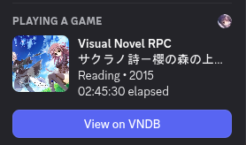
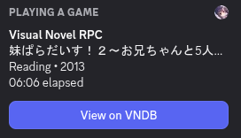
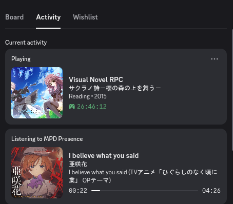
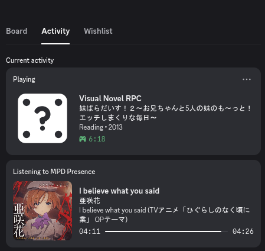
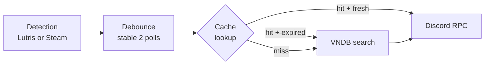
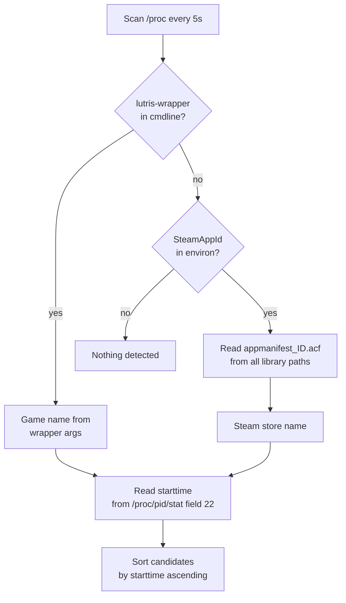
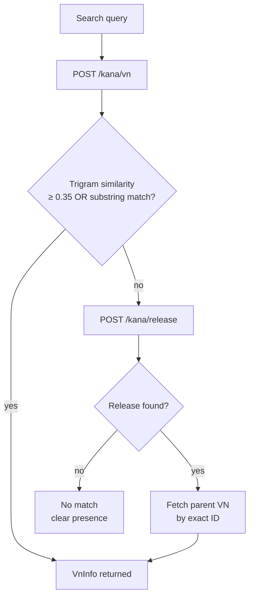
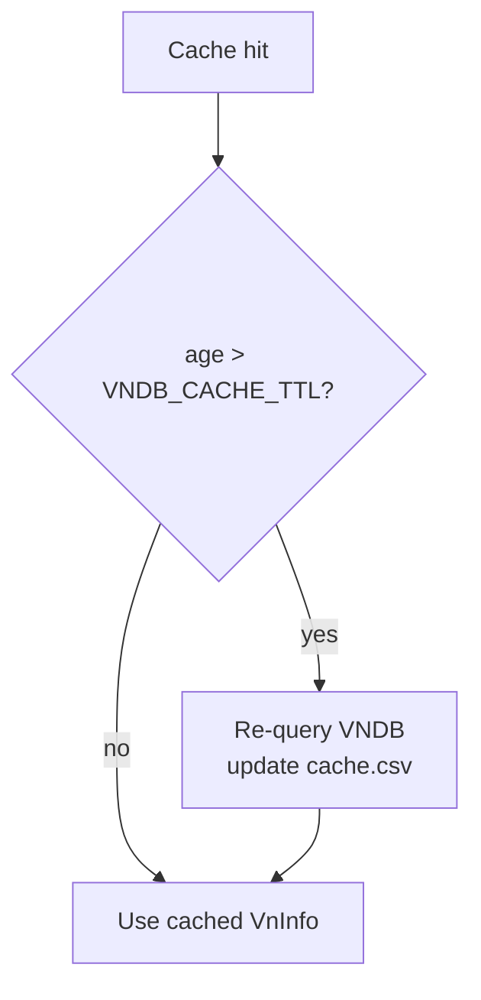
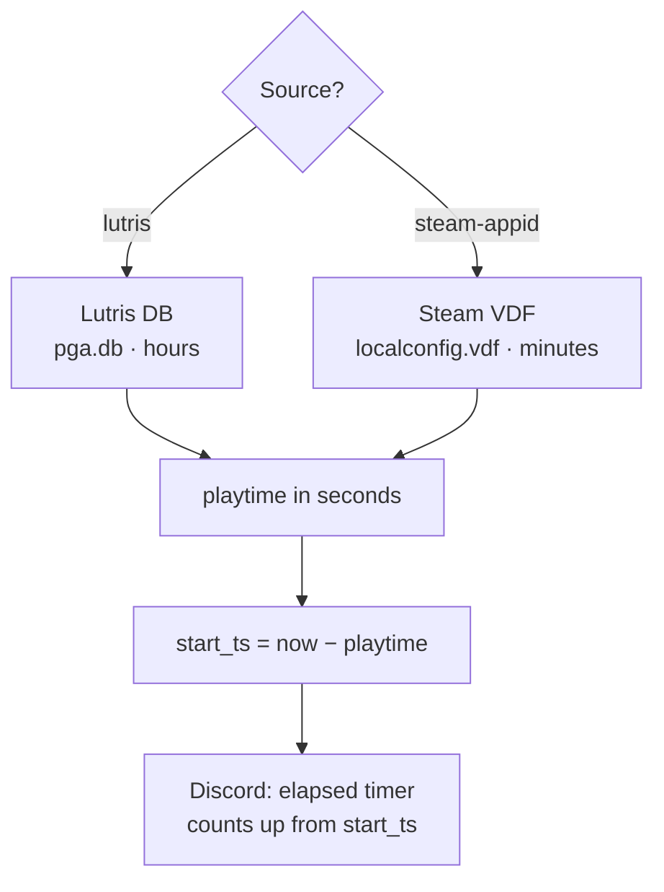

[](https://github.com/jayng9663/VN-Presence)
[](https://www.gnu.org/licenses/agpl-3.0)
[](https://en.cppreference.com/w/cpp/23)

Discord Rich Presence daemon for Visual Novels on Linux. Detects games launched via **Lutris** or **Steam**, looks them up on [VNDB](https://vndb.org), and shows the title, cover art, and total playtime in your Discord status.

### Voice channel

 

### User activity

 

---

## Features

- Detects games from **Lutris** (exact name from wrapper) and **Steam** (AppID → ACF → store name)
- Fuzzy title matching against VNDB using trigram similarity + full-width character normalisation
- Fallback: searches the **release** endpoint and follows the relation back to the parent VN
- Suppresses explicit cover images (sexual ≥ 1.80 or violence ≥ 1.80) — title still shows
- Playtime from **Lutris DB** (`pga.db`) or **Steam VDF** (`localconfig.vdf`) — no API key needed
- Discord elapsed timer reflects **total hours played**, not just this session
- Editable `cache.csv` for aliases, hard-links, and SKIP entries — reloaded live while running
- `ignore.txt` with exact-match for short entries (< 4 chars) to prevent false positives like `sh`

---

## How it works

### Main loop

Every 5 seconds the daemon runs detection, debounces the result, checks the cache, queries VNDB if needed, and updates Discord.



---

### Detection



Lutris passes the game name explicitly as command-line arguments after `lutris-wrapper`, so the name is always exact. Steam injects `SteamAppId` as an environment variable into every game process — the daemon reads it from `/proc/<pid>/environ`, then finds the matching `.acf` file across all Steam library paths (including custom drives read from `libraryfolders.vdf`).

After all candidates are collected, the daemon reads **field 22** (`starttime`) from each process's `/proc/<pid>/stat`. Candidates are then **sorted ascending by starttime**, so the process that launched first is always tried first during VNDB resolution. This makes multi-candidate priority deterministic and reproducible across polls.

> [!NOTE]
> See the [/proc/\[PID\]/stat field reference](proc_stat_fields.md) for a full breakdown of all stat fields.

> [!TIP]
> Run with `--verbose` to see candidates list in the debug output:
> ```
> [DEBUG] src/main.cpp:73 4 game candidate(s) found:
>   [DEBUG] src/main.cpp:75   [lutris] pid=2037324  name="終ノ空 remake"  starttime(clock ticks)=4906595
>   [DEBUG] src/main.cpp:75   [lutris] pid=2086738  name="X-Plane 12"  starttime(clock ticks)=4906701
>   [DEBUG] src/main.cpp:75   [steam-appid] pid=2037822  name="心象天儀本線 ~Per aspera ad astra~ Demo"  starttime(clock ticks)=4906857
>   [DEBUG] src/main.cpp:75   [lutris] pid=2038526  name="サクラノ詩－櫻の森の上を舞う－"  starttime(clock ticks)=4907260
> ```

---

### VNDB resolution



Before the similarity check, full-width ASCII (`！２→!2`, `（→(`) is normalised to half-width so Japanese game names from Lutris match VNDB's stored titles. There is also a substring boost — if the query appears inside the returned title, the score is raised to at least 0.6, handling cases where the detected name is a short prefix of a long VNDB title.

---

### Cache TTL

VNDB results are stored persistently in `cache.csv`. On each cache hit the daemon compares the entry's `cached_at` timestamp against `VNDB_CACHE_TTL`. If the entry is older than the TTL, it is treated as expired and a fresh VNDB query is issued, updating the stored data and timestamp.



This means ratings, cover images, and release dates in the cache are automatically refreshed over time without any manual intervention. The log line when a re-query fires looks like:

```
[INFO] Cache expired for "..."  age=1442min/1440min — re-querying VNDB
```

---

### Playtime → Discord elapsed timer



---

### Cache file (`cache.csv` / `cache.db`)

Located at `~/.config/vn-discord-rpc/cache.csv` (default) or `cache.db` when `CACHE_USE_DB = true`. Reloaded automatically whenever the file changes on disk.

| Column | Purpose |
|---|---|
| `key` | Detected Visual Novels name (the search term) |
| `alias` | Redirect this key to a different search term |
| `vndb_id` | `v562`, `v67`, `SKIP`, or empty |
| `title` | Romanised VNDB title (auto-filled) |
| `alt_title` | Original script title, e.g. Japanese (auto-filled) |
| `image_url` | Cover image URL (auto-filled, blank if explicit(sexual or violence)) |
| `image_sexual` | VNDB sexual rating 0–2 (auto-filled) |
| `image_violence` | VNDB violence rating 0–2 (auto-filled) |
| `rating` | VNDB community rating 0–100 (auto-filled) |
| `released` | Release date (auto-filled) |
| `cached_at` | Unix timestamp of last write (auto-filled) |

**Examples:**

```csv
# Alias — fix wrong or garbled detection
Nice boat!,School Days,,,,,,,,

# Skip — suppress presence for this title
妹ぱらだいす！２,,SKIP,,,,,,,

# Hard-link — bypass VNDB query, point directly to an entry
My VN Title,,v67,,,,,,,
```

---

### Ignore list (`ignore.txt`)

Located at `~/.config/vn-discord-rpc/ignore.txt`. One entry per line, `#` for comments. Reloaded automatically while running.

Matching rules:
- Entry **< 4 characters**: exact match (case-insensitive) — (ie. prevents `sh` matching `Higurashi`)
- Entry **≥ 4 characters**: case-insensitive substring match

The default file includes common false-positives: Steam runtimes, Proton, Wine helpers, and launchers.

> [!WARNING]
> If a title has no VNDB match, the daemon automatically adds it to ignore.txt after the first failed query.
> It will not be retried on subsequent polls. To force a retry, remove the entry from ignore.txt.
> To permanently suppress it without querying VNDB at all, add a SKIP entry to cache.csv instead.

---

## Configuration (`src/config.hpp`)

> [!CAUTION]
> Be caution on changing `IMAGE_SEXUAL` and `IMAGE_VIOLENCE` thresholds in `src/config.hpp`.
> Those thresholds are set to `1.80` (slightly below VNDB's **Explicit** level of `2.00`)
> because VNDB image ratings are user-reported and may be underrated by a small margin —
> the 0.20 buffer ensures borderline explicit covers are still suppressed.
> Raising the threshold above `2.00` would cause explicit (pornographic) cover art to appear
> in your Discord status, visible to everyone on your friends list. Displaying explicit
> content in Discord Rich Presence may violates [Discord's Terms of Service](https://discord.com/terms)
> and **may result in a permanent account ban**.

| Constant | Default | Description |
|---|---|---|
| `DISCORD_APP_ID` | `1482345564698841189` | Discord application ID |
| `IMAGE_SEXUAL` | `1.80` | Maximum threshold value for sexual before being suppressed |
| `IMAGE_VIOLENCE` | `1.80` | Maximum threshold value for violence before being suppressed |
| `VNDB_MIN_SIMILARITY` | `0.35` | Minimum trigram score to accept a match |
| `POLL_INTERVAL` | `5s` | How often to scan for running processes |
| `VNDB_CACHE_TTL` | `24h` | How long a `cache.csv` or `cache.db` entry is valid before re-querying VNDB |
| `STABLE_TITLE_POLLS` | `2` | Polls a title must be stable before acting |
| `CACHE_USE_DB` | `false` | **[Experimental]** Use SQLite (`cache.db`) instead of CSV (`cache.csv`) |

---

## Building

> [!IMPORTANT]
> Initialise submodules before building — the two header-only dependencies are not
> downloaded automatically.
> ```bash
> git submodule update --init --recursive
> ```

```bash
cmake -B build -DCMAKE_BUILD_TYPE=Release
cmake --build build
```

## Dependencies

| Library | Purpose |
|---|---|
| [discord-presence](https://github.com/EclipseMenu/discord-presence) | Discord Rich Presence (modern C++ rewrite) |
| [nlohmann/json](https://github.com/nlohmann/json) | JSON parsing |
| [cpp-logger](https://github.com/jayng9663/cpp-logger) | Logging |
| [libcurl](https://curl.se/libcurl/) | HTTP requests to VNDB API |
| [libsqlite3](https://www.sqlite.org/) | Read Lutris playtime database |

---

## Usage

> [!TIP]
> Run with `--verbose` if a title is not being detected or matched — the debug output shows
> exactly which process was found, what VNDB returned, and the similarity score.

```bash
./vn-discord-rpc            # normal
./vn-discord-rpc --verbose  # debug logging
./vn-discord-rpc --help
```

Launch a game through **Lutris** or **Steam**, and the daemon will detect it automatically. Press `Ctrl+C` to quit cleanly.

---

## File locations

| File | Path |
|---|---|
| Cache (CSV) | `~/.config/vn-discord-rpc/cache.csv` |
| Cache (SQLite, experimental) | `~/.config/vn-discord-rpc/cache.db` |
| Ignore list | `~/.config/vn-discord-rpc/ignore.txt` |
| Lutris DB | `~/.local/share/lutris/pga.db` |
| Steam VDF | `~/.local/share/Steam/userdata/<id>/config/localconfig.vdf` |
